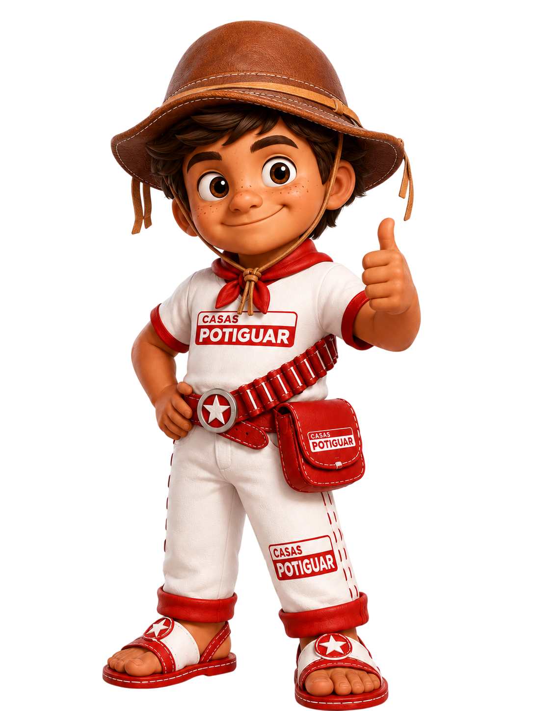

  

# Trabalho final de TI

## PROJETO: Casas Potiguar 

  &nbsp;&nbsp;&nbsp;
  

Uma loja online de produtos para casa como móveis, lâmpadas, utensílios, utilitários ...
Que busca os melhores preços dentre diversos sites e te indica o melhor lugar para comprar.

## Diagrama:

## Equipe:

Davi Guilhereme: Líder técnico

André Luis: Back-end

João Lucas: Front-end

Israel Ahmed: QA Testes

Mattheus Isaac: Jest Testes
